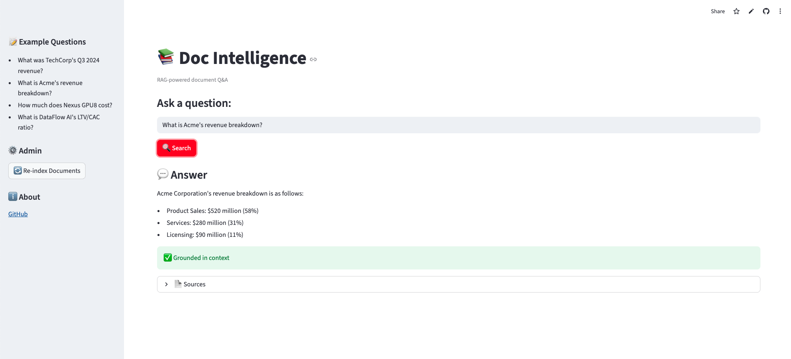
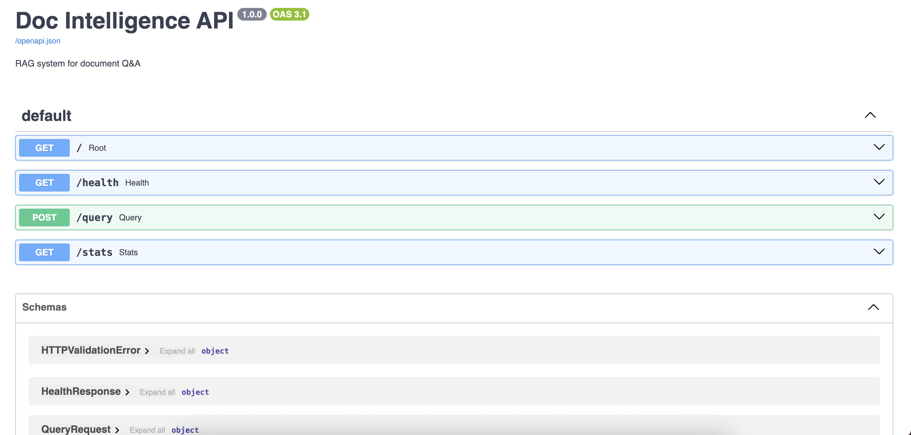

# Doc Intelligence

[](https://doc-intelligence-m7xklhzxv3dadwmcenar9f.streamlit.app)
[](https://github.com/SAMithila/doc-intelligence/actions)

**[→ Try the Live Demo](https://doc-intelligence-m7xklhzxv3dadwmcenar9f.streamlit.app)**

RAG system for document Q&A. Built to learn what actually works in retrieval systems vs. what's hype.

## Results

Evaluated on 38 queries across 5 documents:

| Category | Accuracy |
|----------|----------|
| Easy | 87% |
| Vague | 64% |
| Hard | 67% |
| **Overall** | **74%** |

| Metric | Value |
|--------|-------|
| Retrieval | 285ms |
| Generation | 1,573ms |
| Total | 1,858ms |

## What I Tried

| # | Experiment | Result | Decision |
|---|------------|--------|----------|
| 001 | Baseline | 80% accuracy, Q3 query failed | Found chunking bug |
| 002 | Recursive chunking | Fixed the failure | ✅ Keep |
| 003 | Hybrid search | +6% accuracy | ✅ Keep |
| 004 | Reranking | +5s latency, 0% gain | ❌ Rejected |
| 005 | HyDE | +20% on vague queries | ✅ Conditional |
| 006 | Evaluation framework | 38-query test set | ✅ Essential |
| 007 | Hallucination detection | Catches fabrications | ✅ Keep |

## Key Learnings

**Chunking matters more than retrieval.** Fixed-size chunking split "Q3 2024" from "$1.15 billion". A chunk literally started with "ervices" (mid-word cut). Recursive chunking fixed it.

**Measure latency, not just accuracy.** Reranking moved correct chunk to #1. Then I measured: 5 seconds per query. Killed it.

**Easy tests lie.** For 5 days I got 100% accuracy. Then I built proper evaluation with vague queries. Real accuracy: 77%.

## Architecture
```
User Query
    │
    ▼
┌─────────────────────────────────────┐
│   HyDE (if query ≤ 3 words)         │
└─────────────┬───────────────────────┘
              │
    ┌─────────┴─────────┐
    ▼                   ▼
┌────────┐        ┌──────────┐
│Semantic│        │   BM25   │
│ Search │        │  Search  │
└────┬───┘        └────┬─────┘
     └────────┬────────┘
              ▼
       Rank Fusion (RRF)
              │
              ▼
         GPT-4o-mini
              │
              ▼
    Groundedness Check (optional)
              │
              ▼
          Response
```

## Quick Start
```bash
git clone https://github.com/SAMithila/doc-intelligence.git
cd doc-intelligence
pip install -e .

export OPENAI_API_KEY=your_key

# Run evaluation
python tests/test_evaluation.py

# Start UI
streamlit run app/streamlit_app.py
```

## Project Structure
```
src/docint/
├── ingest/        # Chunking (fixed, recursive)
├── retrieval/     # Semantic, BM25, hybrid, HyDE
├── generation/    # LLM answer generation
├── verification/  # Hallucination detection
├── evaluation/    # Metrics and testing
└── api/           # FastAPI endpoints

experiments/       # Documented experiments
docs/              # Architecture decisions
```

## Design Decisions

| Decision | Choice | Why |
|----------|--------|-----|
| Chunking | Recursive | Fixed-size broke semantic units |
| Search | Hybrid (BM25 + semantic) | +6% accuracy |
| Reranking | Rejected | 5s latency, no gain |
| HyDE | Conditional only | Expensive, use for short queries |
| Vector store | ChromaDB | Simple, good for <100K docs |

See [docs/architecture_decisions.md](docs/architecture_decisions.md) for details.

## Screenshots

### Streamlit UI


### FastAPI


## What I'd Do Differently

1. **Start with hard test cases** — Easy queries always pass
2. **Measure latency from day 1** — Would've caught reranking faster
3. **Build evaluation first** — Before adding features
